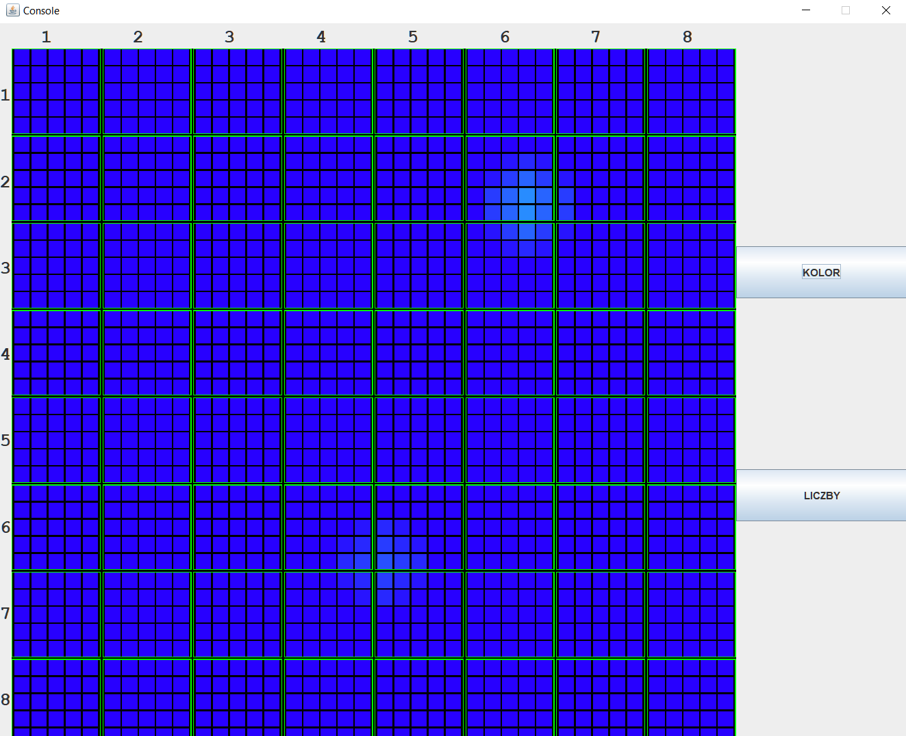
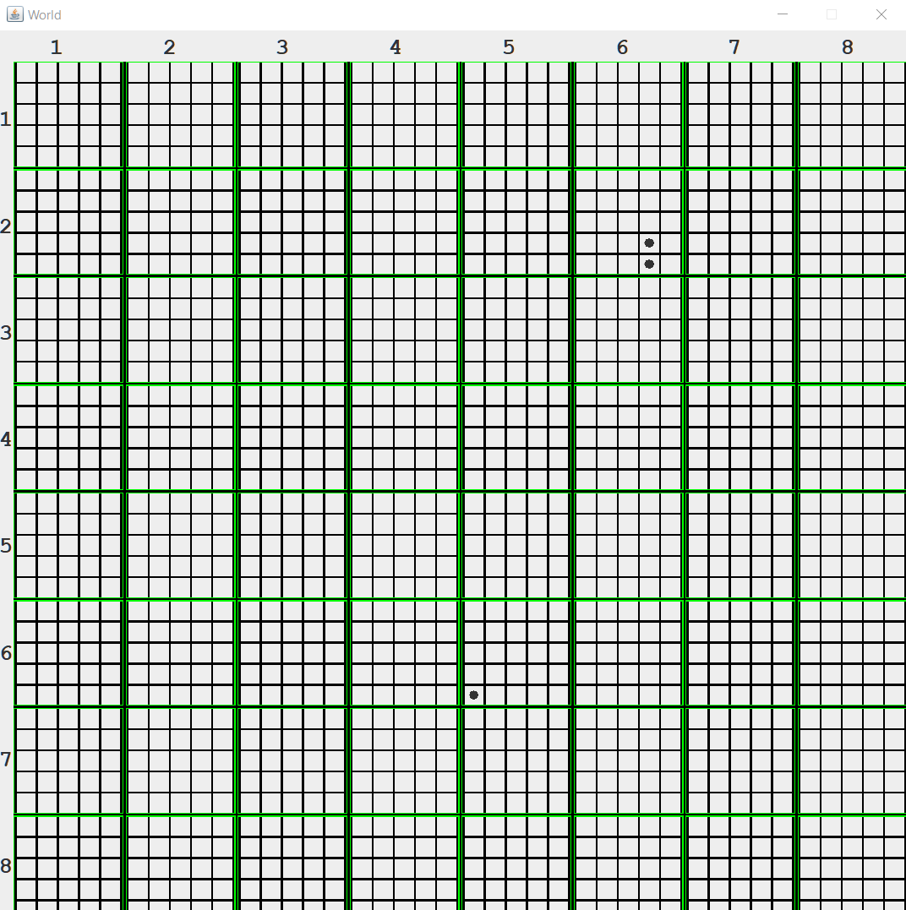
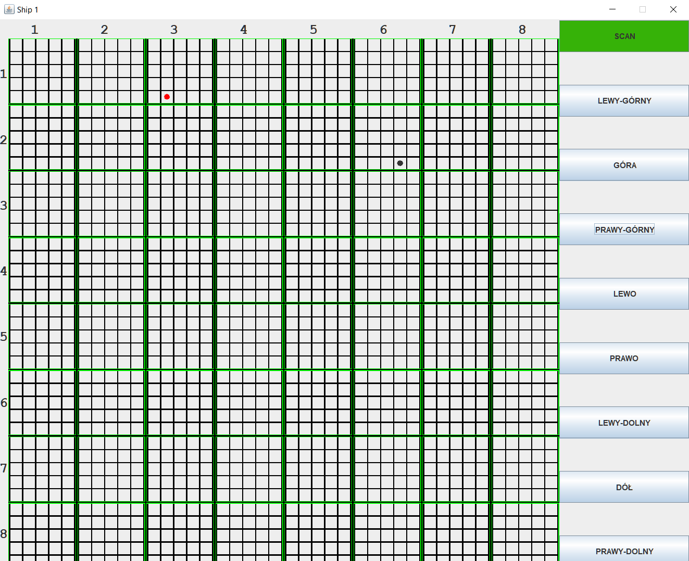
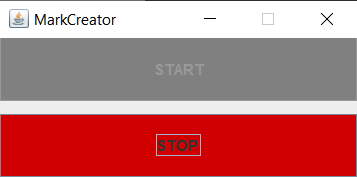

# Lab6-Ships
Celem programu była nauka implementowania socketów w Javie, za pomocą stworzenia 4 programów:

  -Console: konsola, której zadaniem było odbieranie informacji z 64 boi, które nadawały informacje o poziomie morza oraz przedstawienie ich za pomocą interfejsu,
  
  -World: interfejs, który przedstawia całe morze (widać tylko statki),
  
  -Ship: konsola wraz z interfejsem, za pomocą którego można poruszać się statkami po morzu oraz skanować morze,
  
  -MarkCreator: dodatkowa aplikacja, której zadaniem stworzenie jest 64 boi, które będą komunikować się z konsolą.

